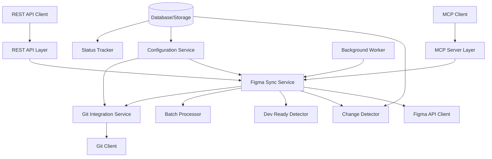
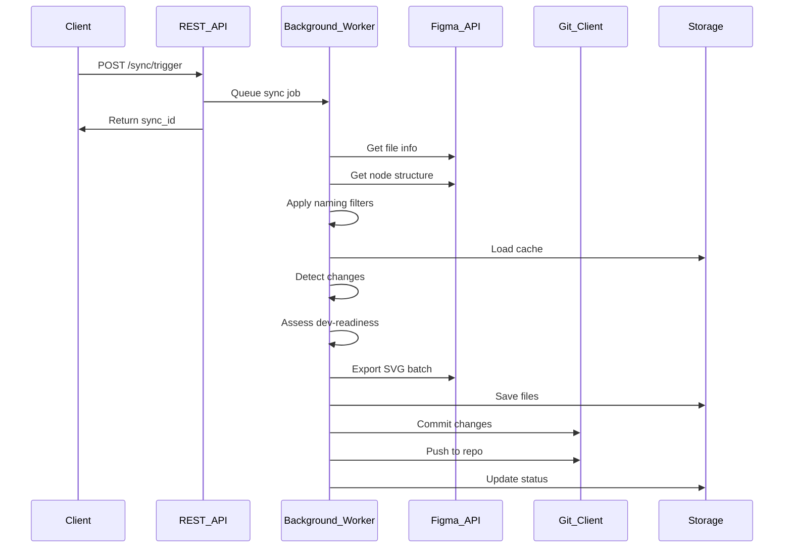
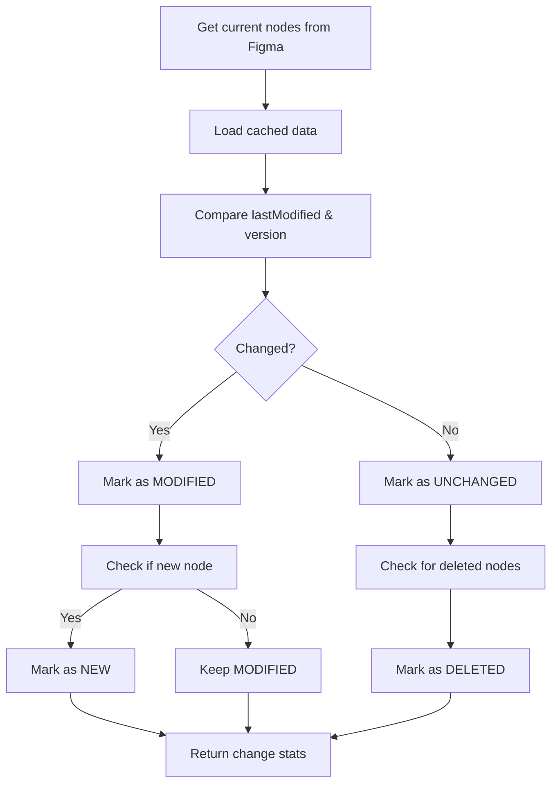

# Thiết kế MCP Server đồng bộ SVG từ Figma

## Tổng quan hệ thống

MCP Server này được thiết kế để đồng bộ tài nguyên SVG từ file Figma vào thư mục repo sử dụng git. Server triển khai Model Context Protocol (MCP) và cung cấp REST API để quản lý quá trình đồng bộ.

### Mục tiêu chính
- **Đồng bộ tự động**: Phát hiện thay đổi trong Figma và đồng bộ SVG vào repo
- **Đánh giá sẵn sàng phát triển**: Đánh giá trạng thái dev-ready của các node
- **Xử lý theo batch**: Tối ưu hóa hiệu suất với xử lý batch
- **Tích hợp Git**: Tự động commit và push thay đổi
- **REST API**: Cung cấp endpoints để trigger sync, query status, manage config

### Kiến trúc tổng thể



## Các thành phần chính

### 1. MCP Server Layer
- Triển khai MCP protocol để giao tiếp với AI models
- Xử lý requests từ MCP clients
- Chuyển đổi requests thành internal service calls

### 2. REST API Layer
- FastAPI-based REST endpoints
- Authentication và authorization
- Request validation và response formatting

### 3. Figma Sync Service
- Core service xử lý đồng bộ
- Tích hợp logic từ enhanced exporter script
- Quản lý workflow đồng bộ

### 4. Git Integration Service
- Xử lý git operations (commit, push)
- Branch management
- Conflict resolution

### 5. Configuration Service
- Centralized configuration management
- Environment-specific settings
- Dynamic config updates

## API Specifications

### REST Endpoints

#### 1. Trigger Sync
```
POST /api/v1/sync/trigger
```
**Request Body:**
```json
{
  "file_key": "string",
  "node_id": "string",
  "output_dir": "string",
  "force_sync": false,
  "commit_message": "string",
  "naming_filters": {
    "include_patterns": ["svg_export_*", "image_export_*", "icon_*"],
    "exclude_patterns": ["temp_*", "draft_*"],
    "case_sensitive": false
  }
}
```

**Response:**
```json
{
  "sync_id": "string",
  "status": "queued",
  "message": "Sync job queued successfully",
  "filters_applied": {
    "include_count": 3,
    "exclude_count": 2
  }
}
```

#### 2. Query Sync Status
```
GET /api/v1/sync/{sync_id}/status
```

**Response:**
```json
{
  "sync_id": "string",
  "status": "running|completed|failed",
  "progress": {
    "total_nodes": 100,
    "processed": 45,
    "exported": 30,
    "failed": 5
  },
  "change_stats": {
    "new": 10,
    "modified": 15,
    "unchanged": 70,
    "deleted": 5
  },
  "dev_ready_stats": {
    "ready": 25,
    "approved": 10,
    "review": 15,
    "draft": 45
  },
  "git_commit": {
    "hash": "string",
    "message": "string",
    "timestamp": "string"
  },
  "errors": ["string"]
}
```

#### 3. Get Configuration
```
GET /api/v1/config
```

#### 4. Update Configuration
```
PUT /api/v1/config
```

#### 5. List Sync History
```
GET /api/v1/sync/history
```

## Data Flow

### Naming Filter Processing

Khi nhận được `naming_filters` trong sync request, hệ thống sẽ:

1. **Parse patterns**: Chuyển đổi wildcard patterns thành regex
   - `svg_export_*` → `^svg_export_.*`
   - `image_export_*` → `^image_export_.*`

2. **Filter nodes**: Áp dụng filter trước khi change detection
   ```python
   def matches_pattern(name, patterns, case_sensitive=False):
       flags = 0 if case_sensitive else re.IGNORECASE
       for pattern in patterns:
           regex = pattern.replace('*', '.*').replace('?', '.')
           if re.match(regex, name, flags):
               return True
       return False

   # Include filter
   if include_patterns and not matches_pattern(node.name, include_patterns):
       continue

   # Exclude filter
   if exclude_patterns and matches_pattern(node.name, exclude_patterns):
       continue
   ```

3. **Fallback to config**: Nếu không có filters trong request, sử dụng `default_naming_filters` từ config

### 1. Sync Trigger Flow



### 2. Change Detection Flow



## Git Integration

### Commit Strategy
- **Automatic commits**: Tự động tạo commit cho mỗi sync thành công
- **Descriptive messages**: Commit message bao gồm change stats và dev-ready info
- **Branch management**: Sync vào branch riêng hoặc main branch

### Push Strategy
- **Immediate push**: Push ngay sau khi commit thành công
- **Error handling**: Retry logic cho push failures
- **Conflict resolution**: Detect và report merge conflicts

## Configuration Management

### Config Structure
```json
{
  "figma": {
    "api_token": "string",
    "batch_size": 10,
    "delay_between_batches": 1.5,
    "max_concurrent_requests": 5,
    "retry_delay": 60,
    "max_retries": 3
  },
  "git": {
    "repo_path": "string",
    "remote_name": "origin",
    "branch": "main",
    "auto_commit": true,
    "auto_push": true
  },
  "sync": {
    "cache_duration": 3600,
    "dev_ready_threshold": 0.8,
    "force_sync_allowed": true,
    "default_naming_filters": {
      "include_patterns": ["svg_export_*", "image_export_*", "icon_*"],
      "exclude_patterns": ["temp_*", "draft_*"],
      "case_sensitive": false
    }
  },
  "server": {
    "host": "localhost",
    "port": 8001,
    "cors_origins": ["*"]
  }
}
```

## Error Handling & Monitoring

### Error Types
- **Figma API Errors**: Rate limiting, authentication, network issues
- **Git Errors**: Commit conflicts, push failures, repo access issues
- **File System Errors**: Permission issues, disk space
- **Configuration Errors**: Invalid config, missing parameters

### Monitoring
- **Health checks**: `/health` endpoint
- **Metrics**: Prometheus-compatible metrics
- **Logging**: Structured logging với correlation IDs
- **Alerts**: Email/webhook notifications cho critical errors

## Security Considerations

### Authentication
- **API Keys**: Figma API token encryption
- **JWT Tokens**: Cho REST API authentication
- **Git Credentials**: Secure storage và rotation

### Authorization
- **Role-based access**: Admin, user roles
- **Scope limitations**: Restrict file keys, node IDs

### Data Protection
- **Encryption**: Config values encryption at rest
- **Audit logs**: Track all sync operations
- **Rate limiting**: Prevent abuse

## Deployment & Scaling

### Development Environment
- **Local setup**: Direct installation, no Docker
- **Hot reload**: Development mode với auto-reload
- **Debug tools**: Integrated debugger và profiler

### Production Environment
- **Containerization**: Docker support cho production
- **Orchestration**: Kubernetes manifests
- **Load balancing**: Multiple instances support

### Scaling Strategy
- **Horizontal scaling**: Stateless design
- **Background jobs**: Async processing với queue
- **Caching**: Redis cho session và config cache

## Integration Points

### 1. Figma Integration
- **API Version**: v1
- **Endpoints**: files, images, nodes
- **Rate Limiting**: Built-in handling
- **Error Recovery**: Retry logic với exponential backoff

### 2. Git Integration
- **GitPython library**: Python git operations
- **Branch strategies**: Feature branches cho syncs
- **Merge handling**: Auto-merge hoặc manual resolution

### 3. MCP Integration
- **Protocol Version**: Latest MCP spec
- **Tool Discovery**: Dynamic tool registration
- **Context Sharing**: Share sync status với MCP clients

## Performance Optimization

### Batch Processing
- **Optimal batch size**: 10 nodes/batch (từ testing)
- **Delay tuning**: 1.5s between batches
- **Concurrent requests**: Max 5 concurrent downloads

### Caching Strategy
- **Change cache**: 1 hour duration
- **SVG cache**: Local file cache
- **API response cache**: Short-term caching

### Monitoring & Profiling
- **Performance metrics**: Response times, throughput
- **Resource usage**: Memory, CPU monitoring
- **Bottleneck identification**: Profiling tools integration

## Testing Strategy

### Unit Tests
- **Service layer**: Mock external dependencies
- **Logic validation**: Change detection, dev-readiness algorithms
- **Error handling**: Edge cases và failure scenarios

### Integration Tests
- **API endpoints**: Full request/response cycle
- **Figma API**: Mock responses cho consistent testing
- **Git operations**: Test repo với local git setup

### End-to-End Tests
- **Full sync workflow**: Từ trigger đến git push
- **Real Figma data**: Controlled test files
- **Performance testing**: Load testing với multiple syncs

## Migration & Rollout

### Data Migration
- **Cache migration**: Migrate existing cache files
- **Config migration**: Update config format
- **Database migration**: Schema updates nếu cần

### Rollout Strategy
- **Phased rollout**: Beta testing với limited users
- **Feature flags**: Gradual feature enablement
- **Rollback plan**: Quick rollback procedures

## Future Enhancements

### Planned Features
- **Webhook support**: Real-time sync triggers
- **Multi-repo support**: Sync to multiple repositories
- **Advanced filtering**: Custom node selection criteria
- **Preview mode**: Dry-run capability
- **Collaboration features**: Multi-user sync management

### Technology Evolution
- **GraphQL API**: Thay thế REST endpoints
- **Event streaming**: Real-time status updates
- **AI-powered assessment**: ML-based dev-readiness scoring
- **Plugin ecosystem**: Extensible architecture

---

**Document Version**: 1.0
**Date**: 2025-08-28
**Author**: Kilo Code
**Review Status**: Draft