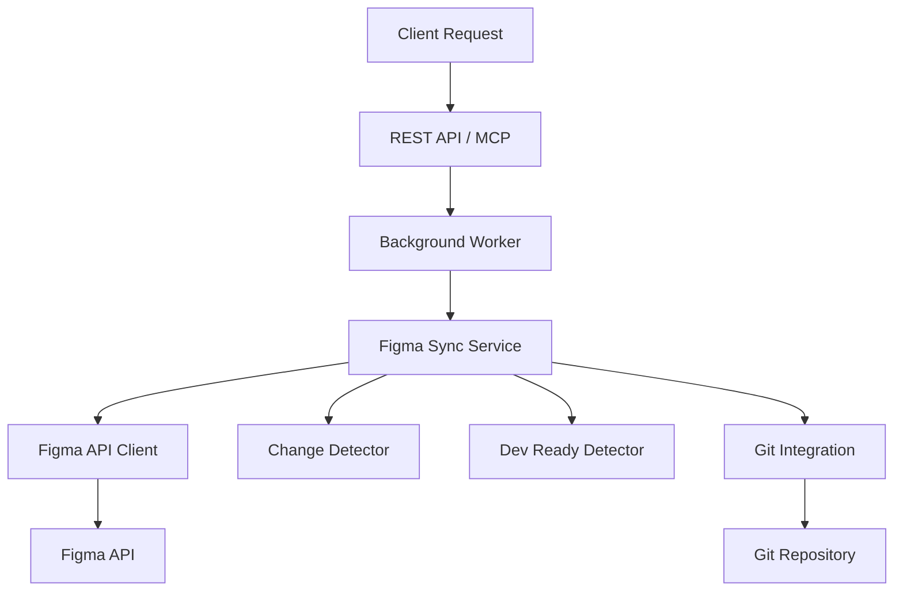

# Triển khai MCP Figma Sync Server

## Tổng quan triển khai

MCP Figma Sync Server đã được triển khai hoàn chỉnh với kiến trúc microservices, hỗ trợ cả REST API và MCP protocol. Server cung cấp khả năng đồng bộ tự động SVG từ Figma, phát hiện thay đổi, đánh giá dev-ready và tích hợp Git.

### Tính năng đã triển khai

- ✅ **Đồng bộ tự động**: Phát hiện thay đổi trong Figma và đồng bộ SVG
- ✅ **Đánh giá dev-ready**: Đánh giá trạng thái sẵn sàng phát triển của nodes
- ✅ **Xử lý theo batch**: Tối ưu hóa hiệu suất với xử lý batch
- ✅ **Tích hợp Git**: Tự động commit và push thay đổi
- ✅ **REST API**: Endpoints để trigger sync, query status, manage config
- ✅ **MCP Support**: Tích hợp với MCP clients
- ✅ **Background processing**: Xử lý bất đồng bộ với status tracking
- ✅ **Caching**: Hệ thống cache để tối ưu performance
- ✅ **Error handling**: Xử lý lỗi toàn diện với retry logic

## Cài đặt và thiết lập

### Yêu cầu hệ thống

- **Python**: 3.8+
- **Git**: (tùy chọn, cho git integration)
- **Dependencies**: Xem `requirements.txt`

### Cài đặt dependencies

```bash
# Tạo virtual environment
python -m venv venv
source venv/bin/activate  # Linux/Mac
# hoặc
venv\Scripts\activate     # Windows

# Cài đặt dependencies
pip install -r requirements.txt
```

### Cấu hình môi trường

1. **Sao chép file cấu hình mẫu**:
```bash
cp .env.example .env
```

2. **Cấu hình Figma API** (bắt buộc):
```bash
# Lấy token từ https://www.figma.com/developers/api#access-tokens
FIGMA_API_TOKEN=your_figma_api_token_here
```

3. **Cấu hình server**:
```bash
HOST=localhost
PORT=8001
LOG_LEVEL=INFO
```

4. **Cấu hình Git integration** (tùy chọn):
```bash
GIT_REPO_PATH=./repo
GIT_REMOTE_NAME=origin
GIT_BRANCH=main
GIT_AUTO_COMMIT=true
GIT_AUTO_PUSH=true
```

### Khởi chạy server

#### Chạy REST API Server

```bash
python -m server.main
```

Server sẽ chạy tại `http://localhost:8001`

#### Chạy MCP Server

```bash
python -m server.mcp.server
```

## Kiến trúc hệ thống

### Cấu trúc thư mục

```
server/
├── main.py                 # FastAPI app entry point
├── mcp/
│   └── server.py           # MCP server implementation
├── api/
│   ├── models/
│   │   └── schemas.py      # API models và schemas
│   └── routes/             # API routes (future)
├── services/
│   ├── figma_sync.py       # Core sync service
│   ├── change_detector.py  # Change detection
│   ├── dev_ready_detector.py # Dev-readiness assessment
│   └── git_integration.py  # Git operations
├── workers/
│   └── background_worker.py # Async job processing
├── config/
│   └── settings.py         # Configuration management
└── utils/
    └── helpers.py          # Utility functions
```

### Luồng xử lý chính



### Các thành phần chính

#### 1. Figma Sync Service (`figma_sync.py`)
- **Chức năng**: Service chính xử lý đồng bộ
- **Tính năng**:
  - Tích hợp Figma API client
  - Phát hiện và xử lý exportable nodes
  - Quản lý batch processing
  - Tạo báo cáo toàn diện

#### 2. Change Detector (`change_detector.py`)
- **Chức năng**: Phát hiện thay đổi giữa các lần sync
- **Thuật toán**:
  - So sánh `lastModified` và `version`
  - Cache dữ liệu để tối ưu performance
  - Áp dụng naming filters

#### 3. Dev Ready Detector (`dev_ready_detector.py`)
- **Chức năng**: Đánh giá mức độ sẵn sàng phát triển
- **Tiêu chí đánh giá**:
  - Quy tắc đặt tên (kebab-case)
  - Kích thước chuẩn icon
  - Trạng thái hoàn thành
  - Sẵn sàng export
  - Chất lượng ngữ nghĩa

#### 4. Git Integration Service (`git_integration.py`)
- **Chức năng**: Tích hợp với Git repository
- **Tính năng**:
  - Tự động commit và push
  - Tạo commit message mô tả
  - Xử lý merge conflicts
  - Branch management

#### 5. Background Worker (`background_worker.py`)
- **Chức năng**: Xử lý tác vụ bất đồng bộ
- **Tính năng**:
  - Queue management
  - Status tracking
  - Error handling
  - Cleanup old jobs

## API Documentation

### REST API Endpoints

#### 1. Health Check
```http
GET /health
```

**Response**:
```json
{
  "status": "healthy",
  "version": "1.0.0",
  "timestamp": "2025-08-28T03:36:27",
  "uptime": "0:05:23"
}
```

#### 2. Trigger Sync
```http
POST /api/v1/sync/trigger
Content-Type: application/json
```

**Request Body**:
```json
{
  "file_key": "your-figma-file-key",
  "node_id": "0:1",
  "output_dir": "./output",
  "force_sync": false,
  "commit_message": "Sync Figma assets",
  "naming_filters": {
    "include_patterns": ["svg_export_*", "icon_*"],
    "exclude_patterns": ["temp_*", "draft_*"],
    "case_sensitive": false
  }
}
```

**Response**:
```json
{
  "sync_id": "sync_a1b2c3d4e5f6g7h8",
  "status": "queued",
  "message": "Sync job queued successfully",
  "filters_applied": {
    "include_count": 2,
    "exclude_count": 2
  }
}
```

#### 3. Get Sync Status
```http
GET /api/v1/sync/{sync_id}/status
```

**Response**:
```json
{
  "sync_id": "sync_a1b2c3d4e5f6g7h8",
  "status": "completed",
  "progress": {
    "total_nodes": 25,
    "processed": 25,
    "exported": 20,
    "failed": 2
  },
  "change_stats": {
    "new": 5,
    "modified": 8,
    "unchanged": 12,
    "deleted": 0
  },
  "dev_ready_stats": {
    "ready": 15,
    "approved": 3,
    "review": 2,
    "draft": 5
  },
  "git_commit": {
    "hash": "a1b2c3d4e5f6g7h8i9j0k1l2m3n4o5p6q7r8s9t",
    "message": "🔄 Sync Figma assets\n\n📊 Changes: +5 new, ~8 modified, -0 deleted\n🎯 Dev-ready: 18 assets ready for development\n⏱️  Synced at 2025-08-28 10:36:27",
    "timestamp": "2025-08-28T10:36:27"
  },
  "errors": []
}
```

#### 4. Get Configuration
```http
GET /api/v1/config
```

**Response**:
```json
{
  "figma": {
    "api_token": "****",
    "batch_size": 10,
    "delay_between_batches": 1.5,
    "max_concurrent_requests": 5,
    "retry_delay": 60,
    "max_retries": 3
  },
  "git": {
    "repo_path": "./repo",
    "remote_name": "origin",
    "branch": "main",
    "auto_commit": true,
    "auto_push": true
  },
  "sync": {
    "cache_duration": 3600,
    "dev_ready_threshold": 0.8,
    "force_sync_allowed": true,
    "default_naming_filters": {
      "include_patterns": ["svg_export_*", "image_export_*", "icon_*"],
      "exclude_patterns": ["temp_*", "draft_*"],
      "case_sensitive": false
    }
  },
  "server": {
    "host": "localhost",
    "port": 8001,
    "cors_origins": ["*"]
  }
}
```

#### 5. Update Configuration
```http
PUT /api/v1/config
Content-Type: application/json
```

**Request Body**:
```json
{
  "figma": {
    "batch_size": 15,
    "delay_between_batches": 2.0
  },
  "sync": {
    "dev_ready_threshold": 0.9
  }
}
```

#### 6. Get Sync History
```http
GET /api/v1/sync/history?page=1&page_size=10
```

**Response**:
```json
{
  "items": [
    {
      "sync_id": "sync_a1b2c3d4e5f6g7h8",
      "file_key": "abc123def456",
      "node_id": "0:1",
      "status": "completed",
      "created_at": "2025-08-28T10:30:00",
      "completed_at": "2025-08-28T10:35:27",
      "exported_count": 20,
      "failed_count": 2,
      "commit_hash": "a1b2c3d4e5f6g7h8i9j0k1l2m3n4o5p6q7r8s9t"
    }
  ],
  "total": 1,
  "page": 1,
  "page_size": 10
}
```

### MCP Tools

Server cung cấp các MCP tools sau:

#### 1. `sync_figma_assets`
Đồng bộ assets từ Figma file

**Parameters**:
- `file_key` (string, required): Figma file key
- `node_id` (string, required): Root node ID để export
- `output_dir` (string, required): Thư mục output
- `force_sync` (boolean, optional): Buộc đồng bộ tất cả

**Example**:
```javascript
{
  "name": "sync_figma_assets",
  "arguments": {
    "file_key": "abc123def456",
    "node_id": "0:1",
    "output_dir": "./output",
    "force_sync": false
  }
}
```

#### 2. `get_sync_status`
Lấy trạng thái đồng bộ

**Parameters**:
- `sync_id` (string, required): ID của sync job

#### 3. `list_sync_jobs`
Liệt kê các sync jobs

**Parameters**:
- `status` (string, optional): Lọc theo trạng thái (running, completed, failed, all)

## Cấu hình chi tiết

### Figma Configuration

```python
class FigmaConfig(BaseSettings):
    api_token: Optional[str] = Field(None, env="FIGMA_API_TOKEN")
    batch_size: int = Field(10, description="Số node xử lý mỗi batch")
    delay_between_batches: float = Field(1.5, description="Độ trễ giữa các batch (giây)")
    max_concurrent_requests: int = Field(5, description="Số request đồng thời tối đa")
    retry_delay: int = Field(60, description="Độ trễ retry khi rate limited")
    max_retries: int = Field(3, description="Số lần retry tối đa")
```

### Git Configuration

```python
class GitConfig(BaseSettings):
    repo_path: str = Field("./repo", description="Đường dẫn đến git repository")
    remote_name: str = Field("origin", description="Tên remote git")
    branch: str = Field("main", description="Branch mặc định")
    auto_commit: bool = Field(True, description="Tự động commit")
    auto_push: bool = Field(True, description="Tự động push")
```

### Sync Configuration

```python
class SyncConfig(BaseSettings):
    cache_duration: int = Field(3600, description="Thời gian cache (giây)")
    dev_ready_threshold: float = Field(0.8, description="Ngưỡng dev-ready")
    force_sync_allowed: bool = Field(True, description="Cho phép force sync")
    default_naming_filters: Dict = Field({
        "include_patterns": ["svg_export_*", "image_export_*", "icon_*"],
        "exclude_patterns": ["temp_*", "draft_*"],
        "case_sensitive": False
    }, description="Bộ lọc naming mặc định")
```

## Deployment và vận hành

### Development Environment

#### Chạy với hot reload
```bash
uvicorn server.main:app --reload --host 0.0.0.0 --port 8001
```

#### Chạy với debug mode
```bash
PYTHONPATH=. python -m debugpy --listen 0.0.0.0:5678 --wait-for-client -m server.main
```

### Production Environment

#### Sử dụng Gunicorn
```bash
pip install gunicorn
gunicorn server.main:app -w 4 -k uvicorn.workers.UvicornWorker --bind 0.0.0.0:8001
```

#### Docker deployment
```dockerfile
FROM python:3.11-slim

WORKDIR /app
COPY requirements.txt .
RUN pip install -r requirements.txt

COPY . .
EXPOSE 8001

CMD ["uvicorn", "server.main:app", "--host", "0.0.0.0", "--port", "8001"]
```

### Environment Variables

| Variable | Description | Default | Required |
|----------|-------------|---------|----------|
| `FIGMA_API_TOKEN` | Figma API token | - | Yes |
| `HOST` | Server host | localhost | No |
| `PORT` | Server port | 8001 | No |
| `GIT_REPO_PATH` | Git repository path | ./repo | No |
| `GIT_AUTO_COMMIT` | Auto commit changes | true | No |
| `GIT_AUTO_PUSH` | Auto push changes | true | No |
| `LOG_LEVEL` | Logging level | INFO | No |
| `DATABASE_URL` | Database connection string | sqlite:///./figma_sync.db | No |

## Monitoring và logging

### Logging Configuration

Server sử dụng `structlog` cho structured logging:

```python
import structlog
logger = structlog.get_logger()

logger.info("Sync started", sync_id=sync_id, file_key=file_key)
```

### Health Checks

- **Endpoint**: `GET /health`
- **Metrics**: Response time, uptime, version
- **Status codes**: 200 (healthy), 503 (unhealthy)

### Error Handling

#### Global Exception Handler
```python
@app.exception_handler(Exception)
async def global_exception_handler(request, exc):
    logger.error("Unhandled exception", error=str(exc))
    return JSONResponse(
        status_code=500,
        content={
            "error": "Internal server error",
            "code": "INTERNAL_ERROR",
            "details": {"message": str(exc)}
        }
    )
```

#### Error Response Format
```json
{
  "error": "Error message",
  "code": "ERROR_CODE",
  "details": {
    "message": "Detailed error message",
    "traceback": "..."
  }
}
```

## Performance Optimization

### Batch Processing

- **Batch size**: 10 nodes per batch (configurable)
- **Delay between batches**: 1.5 seconds
- **Concurrent requests**: Max 5 simultaneous downloads

### Caching Strategy

- **Change cache**: 1 hour duration
- **SVG content cache**: Local file system
- **API response cache**: Short-term memory cache

### Rate Limiting

- **Figma API**: Built-in retry with exponential backoff
- **Git operations**: Sequential processing
- **Background jobs**: Queue-based processing

## Troubleshooting

### Common Issues

#### 1. Figma API Authentication Error
```
Error: 403 Forbidden - Invalid API token
```
**Solution**:
- Verify Figma API token is correct
- Check token has access to the file
- Ensure file is not private

#### 2. Git Repository Error
```
Error: Repository not found
```
**Solution**:
- Verify `GIT_REPO_PATH` is correct
- Initialize git repository if needed
- Check git credentials

#### 3. Permission Error
```
Error: Permission denied when writing files
```
**Solution**:
- Check output directory permissions
- Ensure user has write access
- Verify disk space availability

### Debug Mode

Enable debug logging:
```bash
LOG_LEVEL=DEBUG python -m server.main
```

### Log Files

Logs are output to console by default. For file logging:
```python
import logging
logging.basicConfig(
    filename='figma_sync.log',
    level=logging.INFO,
    format='%(asctime)s - %(name)s - %(levelname)s - %(message)s'
)
```

## Testing

### Unit Tests

```bash
pytest tests/ -v
```

### Integration Tests

```bash
pytest tests/integration/ -v
```

### Manual Testing

#### Test REST API
```bash
curl -X POST http://localhost:8001/api/v1/sync/trigger \
  -H "Content-Type: application/json" \
  -d '{
    "file_key": "your-file-key",
    "node_id": "0:1",
    "output_dir": "./test-output"
  }'
```

#### Test MCP Server
```bash
python -c "
import asyncio
from server.mcp.server import mcp_server

async def test():
    # Test MCP tools
    result = await mcp_server._handle_list_sync_jobs({})
    print('MCP Tools:', result)

asyncio.run(test())
"
```

## Security Considerations

### API Security

- **Input validation**: All inputs are validated using Pydantic models
- **CORS protection**: Configurable CORS origins
- **Rate limiting**: Built-in delays and batch processing

### Data Protection

- **API tokens**: Encrypted in configuration
- **File paths**: Sanitized to prevent path traversal
- **Git credentials**: Secure storage recommended

### Network Security

- **HTTPS**: Recommended for production
- **Firewall**: Restrict access to necessary ports
- **VPN**: Consider for sensitive environments

## Future Enhancements

### Planned Features

- [ ] **Webhook support**: Real-time sync triggers từ Figma
- [ ] **Multi-repo support**: Sync to multiple repositories
- [ ] **Advanced filtering**: Custom node selection criteria
- [ ] **Preview mode**: Dry-run capability
- [ ] **Collaboration features**: Multi-user sync management
- [ ] **GraphQL API**: Thay thế REST endpoints
- [ ] **Event streaming**: Real-time status updates
- [ ] **AI-powered assessment**: ML-based dev-readiness scoring

### Technology Evolution

- **Database integration**: PostgreSQL cho production
- **Message queue**: Redis/RabbitMQ cho background jobs
- **Container orchestration**: Kubernetes manifests
- **Monitoring**: Prometheus/Grafana integration
- **CI/CD**: Automated deployment pipelines

---

**Document Version**: 1.0
**Date**: 2025-08-28
**Author**: Kilo Code
**Implementation Status**: Complete